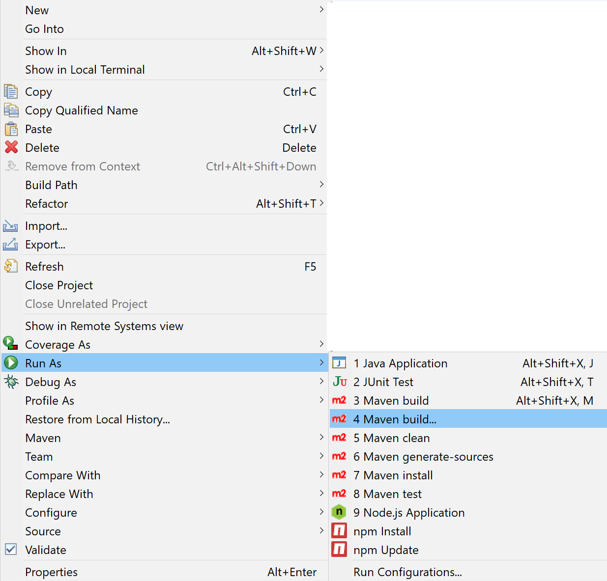
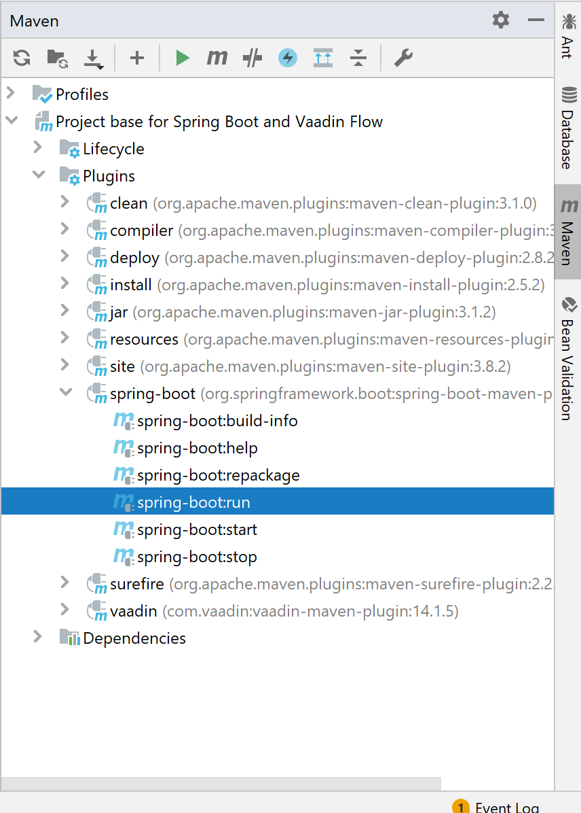

# Project Base for Vaadin and Spring Boot

This is an example project that can be used as a starting point to create your own Vaadin application with Spring Boot.
It contains all the necessary configuration and some placeholder files to get you started.


## Running the Application

Import the project to the IDE of your choosing as a Maven project.

Run the application using `mvn spring-boot:run` or by running the `Application` class directly from your IDE.


In order to start the project a `spring-boot:run` command should be executed. You can use any IDE of your preference,but we suggest Eclipse or Intellij IDEA. 
Configuration for both can be found below.
#### Eclipse
Right click on a project folder and select `Run As` --> `Maven build..` 

#### Intellij IDEA
On the right of the window, select _Maven_--> Plugins--> `spring-boot` --> `spring-boot:run` 


After application has started, you can view your it at http://localhost:8080/ in your browser.


If you want to run the application locally in the production mode, use `spring-boot:run -Pproduction` command instead.
### Running Integration Tests

Integration tests are implemented using TestBench. The tests take a few minutes to run and are therefore included in a separate Maven profile. To run the tests using Google Chrome, execute

`mvn verify -Pit`

and make sure you have a valid TestBench license installed. If the tests fail because of an old Chrome Driver or you want to use a different browser, you'll need to update the webdrivers.xml file in the project root.

Profile `it` adds the following parameters to run integration tests:
```sh
-Dwebdriver.chrome.driver=path_to_driver
-Dcom.vaadin.testbench.Parameters.runLocally=chrome
```

If you would like to run a separate test make sure you have added these parameters to VM Options of JUnit run configuration

## Project overview


## More Information and Next Steps

- [Vaadin Flow](https://vaadin.com/flow) documentation
- [Vaadin Components](https://vaadin.com/components)
- [Using Vaadin and Spring](https://vaadin.com/docs/v14/flow/spring/tutorial-spring-basic.html) article

## Notes

If you run application from command line, remember to prepend a `mvn` to a command.